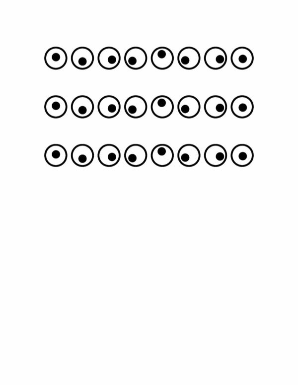

# Wiggle Mono

All eyes.

Type a few in a row and the pupil looks around as it goes.



## Get it

Download from [Releases](https://github.com/michaelsfonts/Wiggle-Mono/releases), or just grab the files from [`fonts/`](fonts):

- **`fonts/desktop/`** — `.otf` and `.ttf` to install on your computer.
- **`fonts/web/`** — `.woff2` and `.woff` for websites.

## Use it on the web

Drop the web files on your site and add this CSS:

```
@font-face {
  font-family: "Wiggle Mono";
  src: url("WiggleMono-Regular.woff2") format("woff2"),
       url("WiggleMono-Regular.woff") format("woff");
  font-weight: 400;
  font-style: normal;
  font-display: swap;
}

.eyes {
  font-family: "Wiggle Mono", monospace;
}
```

The eye-looking-around thing is on by default, so you don't have to do anything extra.

Heads up: it won't work in terminals. They draw one letter at a time, so the pupil just sits still. That's normal, nothing's broken.

## License

Free under the [SIL Open Font License 1.1](OFL.txt) — use it, tweak it, share it. Just don't sell the font on its own.

Copyright (c) 2026, Michael Seh, with Reserved Font Name "Wiggle Mono".

[michaelsfonts.com](https://michaelsfonts.com)
